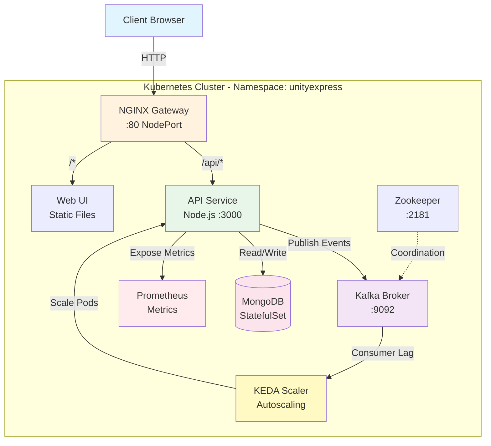
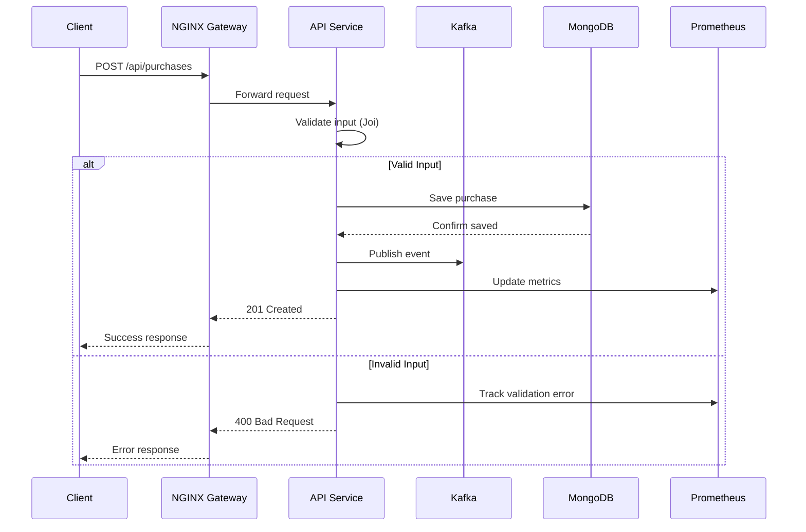
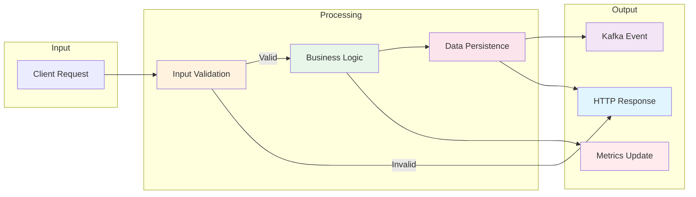

# UnityExpress – Cloud-Native Event-Driven Demo Platform

A complete, production-style microservices project showcasing Kubernetes, Helm, CI/CD patterns, Kafka event streaming, MongoDB persistence, autoscaling with KEDA, NGINX gateway routing, and Docker-based local development.
UnityExpress is intentionally built as a **Senior DevOps Engineer portfolio project**, demonstrating modern cloud-native patterns end to end.

---

## Overview

UnityExpress includes the following services:

- **API Service (Node.js)** - REST API with comprehensive metrics
- **Web UI (NGINX + Static Frontend)** - User interface
- **Kafka + Zookeeper** - Event streaming platform
- **MongoDB StatefulSet** - Persistent data storage
- **KEDA autoscaling** - Event-driven autoscaling based on Kafka consumer lag
- **Prometheus metrics** - 30+ custom business and technical metrics
- **Helm-based deployment** - Infrastructure as Code
- **Makefile automation** - Simple deployment commands
- **Minikube + Docker Desktop** - Local development environment

This project is fully reproducible and can run on **any computer** capable of running Docker Desktop.

---

# Architecture

### High-Level System Architecture



### Request Flow



### Data Flow Architecture



### Deployment Architecture

```mermaid
graph TB
    subgraph "CI/CD Pipeline"
        GH[GitHub Actions]
        Build[Build & Test]
        Push[Push to GHCR]
    end
    
    subgraph "Minikube Cluster"
        subgraph "unityexpress namespace"
            Deploy[Helm Deployment]
            
            subgraph "Services"
                API